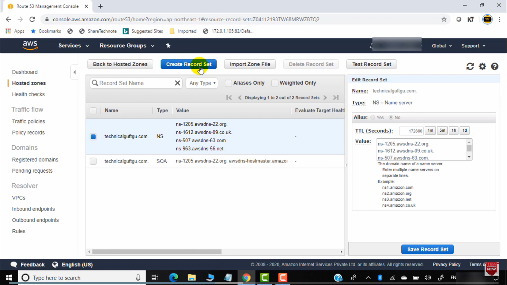

# AWS Route 53 & DNS:
## Route 53

- DNS runs on port 53, hence the name Route 53.
- Route 53 is a scalable and highly available Domain Name System (DNS) web service.
- Route 53 is a global service, which means it is not limited to a single region.
- Route 53 is a managed DNS service.
- You can use Route 53 to register new domains, transfer existing domains, route traffic for your domains to your AWS resources (such as EC2 instances, S3 buckets, and external resources), and monitor the health of your resources.
- Route 53 functions:
    - DNS Management
    - Traffic Management
    - Availability Monitoring
    - Domain Registration

## DNS (Domain Name System)

### How DNS Works

- DNS is a distributed database that maps domain names to IP addresses.
- DNS is a hierarchical system.
- DNS is a client-server system.
- DNS is a TCP/IP application layer protocol.
- DNS uses port 53.
- DNS uses UDP for queries and TCP for zone transfers.

### DNS Components

- **Recursive DNS**: A server that receives DNS queries from clients and queries other DNS servers to resolve the queries.
- **DNS Authoritative Server**: The final step in the DNS lookup process, holding authoritative information for a domain name.
- **Root Domain Server**: The first step in the DNS lookup process, at the top level of the DNS hierarchy.
- **Name Server**: A server that stores DNS records for a domain name.
- **DNS Resolver**: A server that receives DNS queries from clients and queries other DNS servers to resolve the queries.
- **DNS Root Server**: The first step in the DNS lookup process, at the top level of the DNS hierarchy.
- **DNS Top-Level Domain (TLD) Server**: The second step in the DNS lookup process, at the second level of the DNS hierarchy.
- **DNS Cache**: A temporary storage location for DNS records, used to speed up the DNS lookup process by storing previously resolved DNS records.
- **DNS Zone**: A portion of the DNS namespace managed by a single organization or administrator, containing DNS records for a specific domain name.

### DNS Terminology

- **Domain Name**: A human-readable name that represents an IP address. Example: `google.com`.
- **Top-Level Domain (TLD)**: The highest level in the hierarchical Domain Name System. Examples: `.com`, `.org`, `.net`.
- **Second-Level Domain (SLD)**: The portion of the domain name directly to the left of the TLD, representing the main entity. Example: `google.com`, `amazon.com` (where `google` and `amazon` are second-level domains).
- **Fully Qualified Domain Name (FQDN)**: A complete domain name that specifies its exact location in the DNS hierarchy, including the hostname and domain. Example: `www.google.com`, `mail.amazon.com`, `blog.twitter.com`.
- **Hostname**: The label assigned to a specific device or service within a domain, often used as a prefix. For example, `www` in `www.google.com` or `mail` in `mail.google.com`.

### DNS Workflow

- When a client wants to access a website (e.g., `www.google.com`), it sends a DNS query to the DNS resolver.
- The DNS resolver sends a query to the DNS root server to resolve the domain name.
    - The root server responds with the TLD (Top-Level Domain) server for the domain name (e.g., `.com`, `.in`).
- The DNS resolver sends a query to the DNS TLD server to resolve the domain name.
    - The `.com` TLD server responds with the authoritative server for the domain name (e.g., `google.com`).
- The DNS resolver sends a query to the DNS authoritative server to resolve the domain name.
    - The authoritative server responds with the IP address of the domain name.
- The DNS resolver sends the IP address to the client.
- The client uses the IP address to access the website.
- The client caches the IP address for future use.
- The client sends a request to the website using the IP address.

## Part 2: Route 53

### 3 Main Functions

- **Register Domain Names**: You can register domain names with Route 53.
- **DNS Routing**: Route 53 routes internet traffic to the resources for your domain.
- **Health Checks**: Route 53 checks the health of your resources.
    - Route 53 sends automated requests over the internet to a resource (e.g., a web server) to verify that the server is reachable, available, and functional.
    - You can choose to receive notifications if your resources become unavailable or unhealthy.

### Using Route 53

- You can use Route 53 for any combination of these functions:
    - For example, you can use Route 53 for both domain registration and DNS routing.
    - You can use Route 53 to route internet traffic for a domain that you registered with another registrar.

- If you are using another domain provider and you made all the changes:
    - When you migrate an existing domain from one DNS provider (e.g., GoDaddy) to another DNS provider (e.g., Route 53 or FreeNom), this change can take up to 48 hours to propagate across the internet.
    - This is because DNS information is cached by internet service providers (ISPs) and other DNS servers globally for up to 48 hours (TTL - Time To Live period).

### Transferring a Domain to Route 53

- When you transfer a domain to Route 53, you update the name servers for the domain to use Route 53 name servers.
- You can transfer a domain to Route 53 if the TLD (Top-Level Domain) is included in the list of TLDs that Route 53 supports for domain registration. (same domain should support/present in route 53)
- For most TLDs, you can't transfer the domain to Route 53.
- For most TLDs, you need to get an authorization code from the current registrar to transfer the domain to Route 53.

## Route 53 Hosted Zones

- A hosted zone is a container for DNS records for a domain.
- It is a collection of DNS records for a specific domain name.
- You create a hosted zone for a domain and create records to tell the domain name system how you want traffic to be routed for that domain.
- A hosted zone is a container that holds information about how you want to route traffic for a domain and its subdomains (e.g., `www.subdomain1.domain.com`, `www.subdomain2.domain.com`).
- You can create public (internet) hosted zones and private (internal - within VPC) hosted zones.
- For each public hosted zone, Route 53 creates:
    - 4 name server (NS) records. Do not change these records.
    - SOA (Start of Authority) records. Contains information about the hosted zone.
- Route 53 supports both IPv4 and IPv6 addresses.
- Route 53 automatically creates a Name Server (NS) record with the same name as your hosted zone.
- It lists the four name servers that are the authoritative name servers for your domain (e.g., `ns-2048.awsdns-64.com`, `ns-2049.awsdns-65.net`, `ns-2050.awsdns-66.org`, `ns-2051.awsdns-67.co.uk`).
- You can create more than one hosted zone with the same name and add different records to each hosted zone.

## Lab on Route 53

- **Register a Domain Name with Route 53**:
    - Go to the Route 53 console.
    - Choose "Registered domains" and click "Register domain" to create:
        - Enter the domain name that you want to register.

- **Transfer a Domain to Route 53**:
    - Go to the Route 53 console.
    - Choose "Registered domains" and click "Transfer domain" to create:
        - Enter the domain name that you want to transfer.

- **Create a Hosted Zone**:
    - Go to the Route 53 console.
    - Choose "Hosted zones" and click "Create hosted zone" to create:
        - Enter the domain name that you want to create a hosted zone for.
        - 

- **Create a Record Set**:
    - Go to the Route 53 console.
    - Choose "Hosted zones" and click on the hosted zone that you want to add a record set to.
