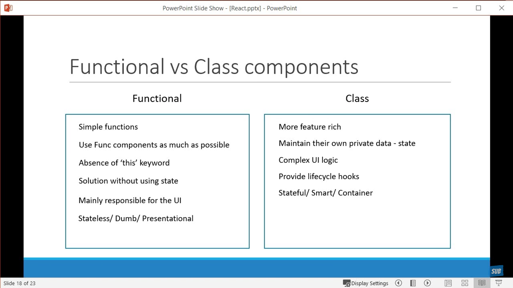

``` javascript
React 
	- Component Based Architecture
	- Reusable code	(reusable component in ANgular and view)
	- It is declaractive
	- 

- Commands:
	Way 1:
		- npx create-react-app hello-world
		- npm package runner
	Way 2:
		- npm install create-react-app -g
		- create-react-app<project_name>

Components:
	- describes a part of the user interface
	- building blocks of react application
Component Types:
	- Stateless Functional Component
	- Stateful Class Component
	
Functional Components:
	- its accepts input properties (props) and returns HTML (jsx)
	
Class component:
	-> props -> ES6 class -> HTML jsx
	-> class Welcome extends Component { render() {
			returns <h1>hello<h1/>
		} }
	- app.js:
		- import Welcome from './..'
		- <Welcome></Welcome>



JSX:
	- Javascript XML (JSX) - extention to the Javascriot language syntax
	- every component returns jsx


Props:
	<Welcome/>
	<Welcome name="Sagar">
		<p>This is children props </p>
	</Welcome>

	Functional child component:
		const Greet = props => {
			return (
				<div>
					<h1> Hello ${props.name}
					</h1>
					{props.children}
				</div>
			)
		}
	Class Child Component:
		- this.props.name


State:
	Class:
		constructor() {
			this.state = { message: 'Welcome visitor'}
		}
		render () <h1> ${this.state.message}
		changeMessage() {
			this.setState({
				message: 'Thank you for subscribing'	// update message within component
			})
		}

Lists and keys:
	- unique to list of childs


Styling React components:
	1. CSS stylesheets
	2. Inline styling:
		filename: appStyle.css	// .error {}
		import ./appStyle.css
		<h1 className='error'>
		<h1 style= {heading}>
		const heading = {
			fontSize: '72px',
			color: 'blue'
		}
	3. CSS Modules:
		filename: appStyle.module.css		// .success {}
		import styles from './appStyle.module.css'
		<h1 className={styles.success}>
	4. CSS in JS library (Styled Component)

	<h1> className={myClassField}>...
	<h1> className={`${myClassField} myclass2`}>...	// 2 classes

LifeCycle methods of Class Components:
	1. Mounting: component created or inserted into dom
		1 constructor(props) {
			super(props) // directly override this.state
		}
		2 static getDerivedStateProps(props, state)
			- change in props
		3 render():
			- only required method
			- read props and state and return jsx
		4 ComponentDidMount()
			- call only once for first time
			- called immediatly, when component and all its children components have been rendered in the DOM
	2. Updating: component rerender by change in state or props
		1 static getDerivedStateFromProps(props, state)
			- called everytime a component re-rendered
		2. shouldComponentUpdate(nextProps, nextState) (return true)
			- dectates if the component should re-render or not
			- performance optimization
		3. render()
		4. getSnapshotBeforeUpdate(prevProps, prevState) (return null)
			- called after all parent and childs are re-rendered.
			- called before changes reflects in DOM
		5. ComponentDidUpdate(prevProps, prevState, snapshot)
			- called only once
			- called after the render is finished in the re-render cycle
			- cause side effects
	3. Unmounting: component removed from DOM
		1 componentWillUnmount:
			- cleanup: network request, removing event handlers, unsubscribe
	4. Error Handling: error during rendering, lifecycle or in constructor
		- static getDerivedStateFromError(error)
		- componentDidCatch(error, info)

Fragement:
	return (
		<Reach.Fragment>		// replacing extra <div> tag // ng-template in angular
			<h1></h1>
			<p></p>
		</React.Fragement>

		-> short hand:
			<>			// empty tag: dont add exta element into the DOM.
				<h1></h1>
				<p></p>
			</>
	)


PureComponent:
	- Works in Class Based Component
	class App extends Component {}	// regular component
	class PureComp extends PureComponent {}	// regular component

	- Regular Component
		- whenever state is changing, lifecycle methods will get called
		- does not implement 'shouldComponentUpdate' lifecycle method. It always returns true by default.
	- Pure Component:
		- Only render when reference is changing (pure change of state)
		- implement shouldComponentUpdate() with a shallow props and state comparison
			- re-render if prevState and currentState change
			- re-render if prevProps and currentProps change

Memo:
	- Works as PureComponent in Function Based Component
	- introduct in React 16.6
	- Skip re-rendering of component/child-component if not pure change:
	- export default React.memo(MemoComp)

Refs:	(similar to view child)
	constructor(props) {
		this.inputRef= React.createRef()	// createRef: @ViewChild("templateRefVariable")
	}

	render() {
		return (
			<div>
			<input type="text" ref={this.inputRef} />	// ref: similar to #templateRefVariable in angular
			</div>
		)
	}
	componentDidMount() {
		this.inputRef.current.focus()	//  when component loaded, it will focus/edit on input box
	}

React.forwardRef:
	- Child Component:
		const FIRInput = React.forwardRef( (props, ref) => {
			return (
				<div>
					<input type="text" ref={ref} />
				</div>
			)
		})
	- parent component:
		<FIRInput ref={this.inputRef} />


Portal:
	ReactDOM.createPortals()
	- index.html have nodes: root
		- by default, entire application is in 'root' dom node
		- public/index.html:
			<div id= "root"> entire application... </div>
			<div id= "portal-root"> entire application... </div>
		- PortalDemo Functional component:
			import ReactDOM from 'react-dom'
			function PortalDemo() {
				return ReactDOM.createPortal(	// need 2 params
					<h1>Portal Demo </h1>,
					document.getElementById('portal-root')
				)
			}
			export default PortalDemo


	- use to add in new node.

Error Boundry:
	- A class component that implements either or both of the error life cycle methods
		getDerivedStateFromError() or componentDidCatch() becomes an error boundry

Higher order component HOC:
	- to share common function between components.
	- syntax: const newComponent = higherOrderComponent(originalComponent)
	- create common code to share among components
	- const UpdatedComponent = OriginalComponent => {
		class NewComponent extends React.Component {
			render() {
				return <OriginamComponent name="Vishwas" {...this.props}/>	// ...props: pass remaining props to HOC implemented functions
			}
			return newComponent
		}
	}
	export default UpdatedComponent

	- const newComponent = higherOrderComponent(originalComponent)
	- original component: component which needed shared code:
		class ClickCounter extends Component {

		}
		export default UpdatedComponent(ClickCounter)

Render Props:
	- to share common function between components.
	- The term 'render props' refers to a technique for sharing code between React components using a prop whose value is a function.


Context:
	- Context provides a way to pass data through the component tree
		without having to pass props down manually at every level.
	- Steps:
		1. Create Context:
			const UserContext = React.createContext()
			const UserContext = React.createContext("defaultValue")
			
			const UserProvider = UserContext.Provider
			const UserConsumer = UserContext.Consumer
			export {UserProvider, UserConsumer}

		2. Provide a context value:
			App.js:
				<UserProvider value="Sagar">
					<ComponentC />
				</UserProvider>
		3. Consume the context value:
			App > ComponentC > ComponentE > ComponentF:
			ComponentF:	
				<UserConsumer>
					{
						username => {
							return <div>Hello {username}</div>
						}
					}
				</UserConsumer>


```